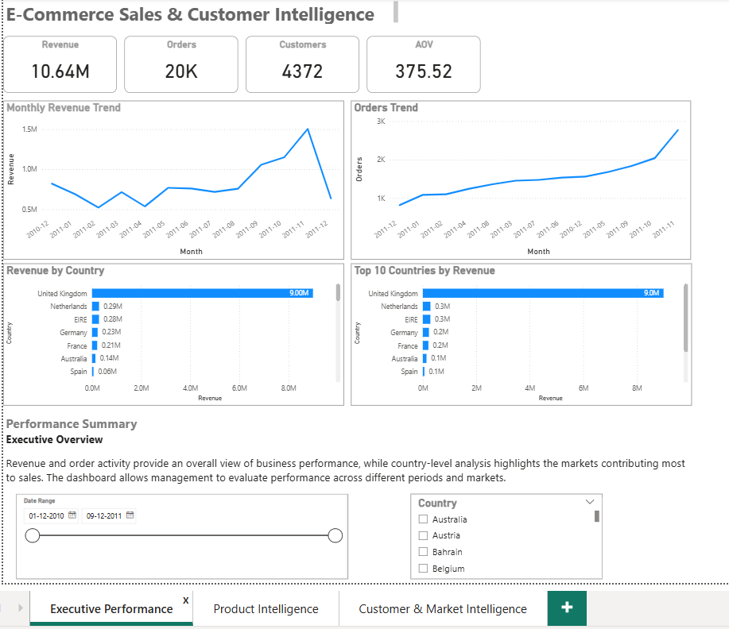
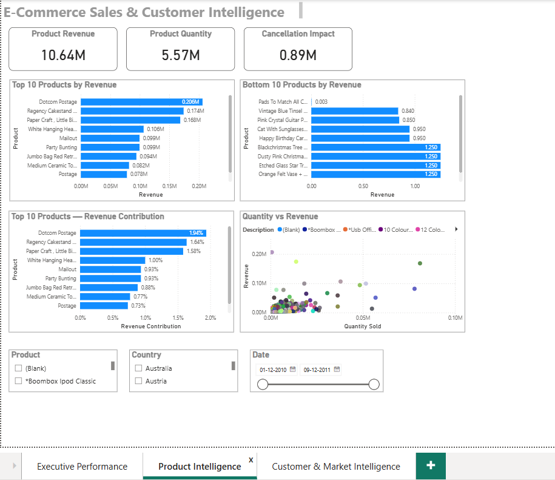
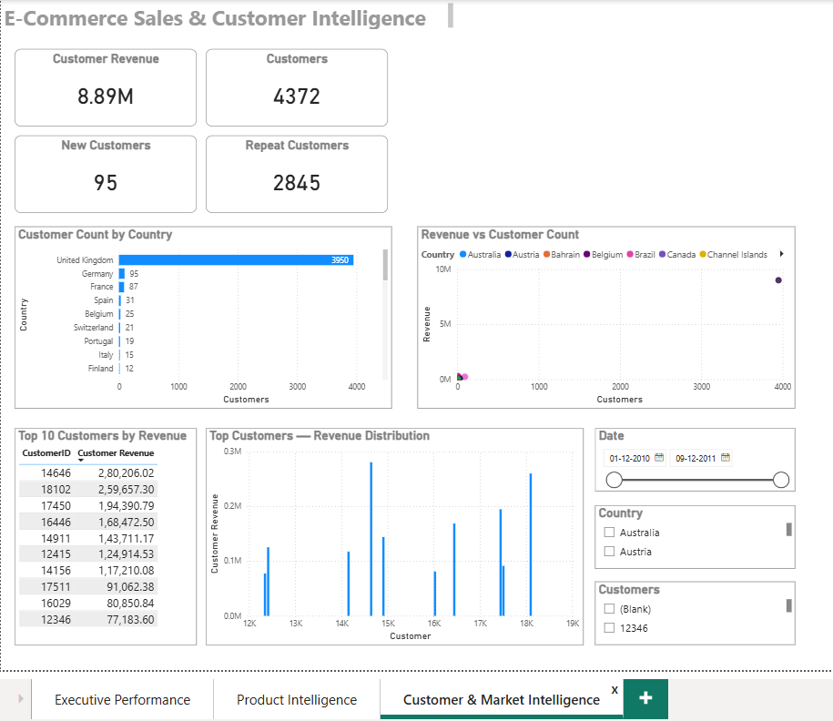

# E-Commerce Sales & Customer Intelligence

Built an interactive Power BI dashboard to analyze e-commerce sales performance, product contribution, customer behavior, and market performance using transactional retail data.

## Business Problem

Management needs a single interactive solution to understand sales performance, product contribution, customer purchasing behavior, and market performance.

## Dataset

**Source:** UCI Online Retail Dataset

The dataset contains approximately 541,000 transaction-level records from an online retailer covering December 2010 to December 2011.

Key fields include:
- Invoice number
- Product code
- Product description
- Quantity
- Invoice date
- Unit price
- Customer ID
- Country

The transaction grain is one product line per invoice.

## Tools Used

- Power BI
- Power Query
- DAX
- Data Modeling

## Project Workflow

1. Business understanding
2. Dataset exploration
3. Data cleaning with Power Query
4. Star-schema data modeling
5. DAX measure development
6. Interactive dashboard development
7. Insight generation
8. Business recommendations
9. Dashboard validation

## Dashboard Pages

### 1. Executive Performance

Analyzes:
- Revenue
- Orders
- Customers
- Average Order Value
- Monthly revenue trends
- Orders trends
- Country performance

### 2. Product Intelligence

Analyzes:
- Product revenue
- Quantity sold
- Top and bottom products
- Product revenue contribution
- Quantity vs revenue
- Cancellation impact

### 3. Customer & Market Intelligence

Analyzes:
- Customer revenue
- Customer count
- New and repeat customers
- Top customers
- Revenue distribution
- Country performance
- Revenue vs customer count

## Key Insights

- The UK is the dominant revenue-generating market.
- Revenue is concentrated among a smaller group of products and customers.
- High sales volume does not always translate into high revenue contribution.
- Cancellation activity represents a meaningful financial impact.
- Customer identification is incomplete for part of the transaction data, limiting customer-level analysis.
- Repeat customers represent a substantial portion of identified customers under the project's calculation.

## Business Recommendations

- Strengthen retention strategies for repeat and high-value customers.
- Protect and grow the core UK market while evaluating international opportunities.
- Improve customer data capture to strengthen customer-level analysis.
- Monitor product concentration and dependency.
- Investigate cancellation patterns and their financial impact.
- Develop targeted strategies for high-value customers.

## Project Outcome

The project transformed raw transactional retail data into an interactive business intelligence solution that connects sales performance, product contribution, customer behavior, and market performance to actionable business decisions.

## Dashboard Preview

### Executive Performance

### Product Intelligence

### Customer & Market Intelligence

